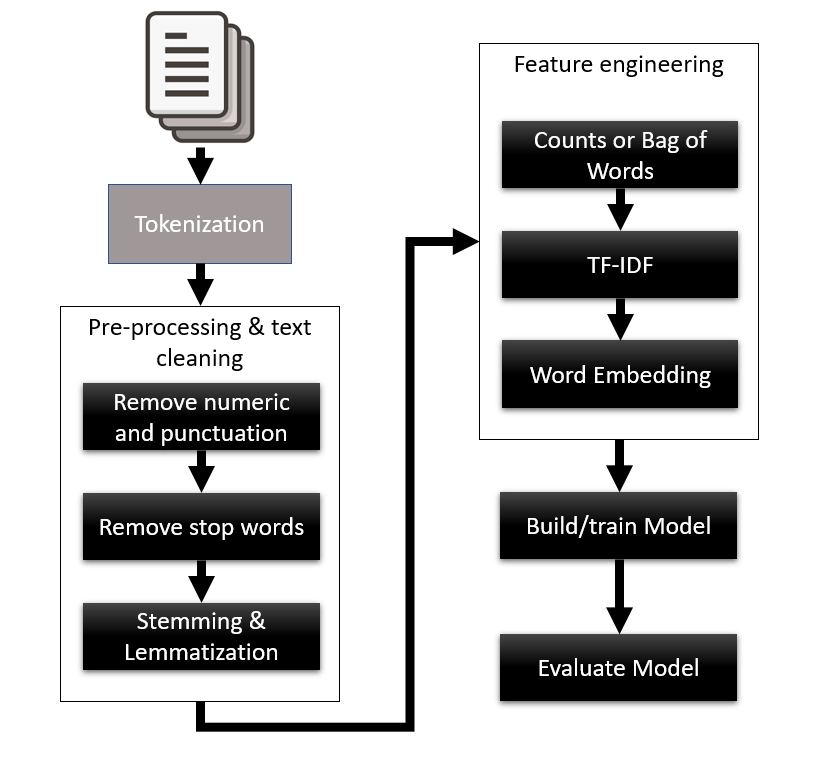
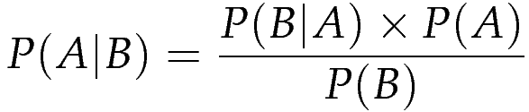

# NLP with Python

## Text Cleaning

In this lab we discover text cleaning. All text needs to be cleaned as a prerequisite to natural language processing.

NLP encompasses the following applications:

- Part of speech tagging
- Word segmentation
- Named entity recognition
- Machine translation
- Question answering
- Sentiment analysis
- Topic segmentation and recognition
- Natural language generation

It all starts though with preparing text for further processing. In this lab you will learn how to use some vanilla Python to clean and prepare text data.

### Read Data

```bash
$ python3
Python 3.8.14 (default, Sep  8 2022, 00:02:10) 
[GCC 7.5.0] on linux
Type "help", "copyright", "credits" or "license" for more information.
```

Starting from a Python interpreter we first need to import the **urllib.request** module with:

```python
import urllib.request
```

We will use **urllib.request** to download the text for a famous book, Moby Dick, from the Gutenberg project with:

```python
url = "https://www.gutenberg.org/files/2701/2701-0.txt"
file = urllib.request.urlopen(url)
```

Next we decode and combine the text with a list comprehension and join like so:

```python
>>> text = [line.decode('utf-8') for line in file]
text = ''.join(text)
```

With all the text loaded now print out an excerpt with:

```python
text[7600:8000]
```

### Tokenize

Moby Dick is now completely captured in text. Next we need to tokenize or break the document into words.

We can do that easily with:

```python
tokens = text.split()
```

The **split** function splits the text on whitespace. We can display a range of words with:

```python
tokens[200:222]
```

We often want to ignore capitalization of words. So we will first lowercase all the text and then tokenize like so:

```python
tokens = text.lower().split()
tokens[200:222]
```

### Remove Punctuation

You may have noticed that many of our tokens still have punctuation. For basic NLP tasks we will often want to isolate or remove punctuation.

We can remove punctuation by first making a translation table with:

```python
import string
table = str.maketrans('', '', string.punctuation)
```

The translation **table** will allow us to translate punctuation to empty using:

```python
tokens = [w.translate(table) for w in tokens]
```

Then we can look at the results with:

```python
tokens[200:222]
```

### Only Alphabetic

For most NLP tasks we want to stick with just language or alphabetic characters. That means removing all non-alphabetic characters.

We can remove all numeric characters with:

```python
tokens = [word for word in tokens if word.isalpha()]
```

The **if word.isalpha()** test filters out all numeric characters.

Then we can look at the results with:

```python
tokens[200:222]
```

### What's Next

The techniques we used in this lab allowed us to reduce our document to a set of tokens. This will work for most simple applications.

For complex applications we would need to reduce or translate the tokens further using the following concepts:

- Remove stop words: like 'the'
- Stemming of words: like 'like' from:
    - likes
    - liked
    - likely
    - liking

- Lemmatization of words:
    - rocks -> rock
    - corpora -> corpus
    - better -> good

Those tasks are better done with a full-featured library like NLTK.

In this chapter we learned the basics of cleaning text for NLP applications. Text cleaning is an essential and first step to any NLP application. It is a tedious process not well covered in most NLP tech demos but you should be aware of this crucial step.

Text cleaning is the first step that you will do or that has been done for any text you process.

## Introduction to NLTK

The Natural Language Toolkit (NLTK) is a comprehensive library for building NLP applications.

In this chapter we learn how to use NLTK to clean, tokenize, and prepare text data.

### Read Data

```bash
$ python3
Python 3.8.14 (default, Sep  8 2022, 00:02:10) 
[GCC 7.5.0] on linux
Type "help", "copyright", "credits" or "license" for more information.
```

Starting from a Python interpreter we first need to import the **urllib.request** module with:

```python
import urllib.request
```

We will use **urllib.request** to download the text for a famous book, Moby Dick, from the Gutenberg project with:

```python
url = "https://www.gutenberg.org/files/2701/2701-0.txt"
file = urllib.request.urlopen(url)
```

Next we decode and combine the text with a list comprehension and join like so:

```python
>>> text = [line.decode('utf-8') for line in file]
text = ''.join(text)
```

With all the text loaded now print out an excerpt with:

```python
text[7600:8000]
```

### Tokenization

With the text document loaded we can move on tokenizing.

NLTK comes with a number of modules and corpora for performing NLP and learning about it. For our purposes we only need the standard tokenizer called 'punkt'.

We can setup and download 'punkt' with the following code:

```python
import nltk
nltk.download('punkt')
```

With NLTK we can tokenize the document into sentences with:

```python
from nltk import sent_tokenize
sentences = sent_tokenize(text)
sentences[200]
```

Or, tokenize the document into words with:

```python
from nltk import word_tokenize
tokens = word_tokenize(text)
tokens[200:222]
```

### Clean Text

With the document tokenized we can return to cleaning the text.

We can remove all numeric characters with:

```python
tokens = [word for word in tokens if word.isalpha()]
tokens[200:222]
```

Remove punctuation with:

```python
import string
table = str.maketrans('', '', string.punctuation)
tokens = [w.translate(table) for w in tokens]
tokens[200:222]
```

Finally, lowercase everything with:

```python
tokens = [word.lower() for word in tokens]
tokens[200:222]
```

### Stop Words

Stop words are common words in NLP that often are better filtered out. These words may include: 'you', 'the', 'it' and so on.

NLTK provides a preassembled list of stop words we can download like so:

```python
nltk.download('stopwords')
```

Then we can remove all the stop words from the tokens with:

```python
from nltk.corpus import stopwords

stop_words = set(stopwords.words('english'))
tokens = [w for w in tokens if not w in stop_words]
tokens[200:222]
```

### Stemming

Stemming is the process of bringing a word to its root value. We clip the stems from the word. Take for example the words like: acquire - acquired, firm - firms or product - production. Reducing a word to its root simplifies the NLP task with little loss to the meaning.

Reducing a word to its root value can have many variations. Fortunately, NLTK provides several and we will use PorterStemmer.

We can load the PorterStemmer and stem the words easily with:

```python
from nltk.stem.porter import PorterStemmer
porter = PorterStemmer()
stemmed = [porter.stem(word) for word in tokens]
stemmed[200:222]
```

With a clean set of tokens in hand we can move on to discovering more about words in the next lab.

### What's Next

NLTK has been fundamental to many NLP applications for the last several years. Other technologies are currently passing this functionality. Understanding and reviewing the NLTK library can provide you with insights on internal and external processes valuable to NLP work.

NLTK is a good base to learn in order to understand how to develop NLP applications.

## Introduction to Bag of Words

A Bag of Words can be used to describe many things about a document in NLP.

In this chapter we learn how to construct a Bag of Words for NLP.

### Read Data

```bash
$ python3
Python 3.8.14 (default, Sep  8 2022, 00:02:10) 
[GCC 7.5.0] on linux
Type "help", "copyright", "credits" or "license" for more information.
```

Starting from a Python interpreter we first need to import the **urllib.request** module with:

```python
import urllib.request
```

We will use **urllib.request** to download the text for a famous book, Moby Dick, from the Gutenberg project with:

```python
url = "https://www.gutenberg.org/files/2701/2701-0.txt"
file = urllib.request.urlopen(url)
```

Next we decode and combine the text with a list comprehension and join like so:

```python
>>> text = [line.decode('utf-8') for line in file]
text = ''.join(text)
```

With all the text loaded now print out an excerpt with:

```python
text[7600:8000]
```

### Tokenize and Clean

After the document is loaded we can proceed to tokenize and clean the document.

First we tokenize with:

```python
import nltk
nltk.download('punkt')
from nltk import word_tokenize
tokens = word_tokenize(text)
```

Then clean with:

```python
import string
tokens = [word for word in tokens if word.isalpha()]
table = str.maketrans('', '', string.punctuation)
tokens = [w.translate(table) for w in tokens]
tokens = [word.lower() for word in tokens]
```

Finally, remove stop words and stem with:

```python
from nltk.corpus import stopwords
nltk.download('stopwords')
stop_words = set(stopwords.words('english'))
tokens = [w for w in tokens if not w in stop_words]

from nltk.stem.porter import PorterStemmer
porter = PorterStemmer()
tokens = [porter.stem(word) for word in tokens]
tokens[200:222]
```

### Vocabulary

With a clean set of tokens we can move on to understanding the vocabulary. A vocabulary of a document represents all the words in that document and the frequency they appear.

NLTK has the **FreqDist** class that can help us count the words in a document with:

```python
from nltk.probability import FreqDist

word_counts = FreqDist(tokens)
word_counts
```

Now that all the words are counted we can extract a vocabulary. In many cases we only want to understand the most frequent words. We can take the top most frequent words like so:

```python
top = 500
vocabulary = word_counts.most_common(top)
    
vocabulary[:10]
```

For most NLP tasks we may want a larger vocabulary that uses 5000 words or more.

### Count Vector

With a vocabulary established we can move on to scoring words. A simple way to score words is by frequency. We can then combine the frequency scores of words with the vocabulary and create a count vector or bag of words.

First we will import a helper library called numpy. Numpy helps us store all manners of data for machine learning.

```python
import numpy as np
```

Then we can create a word vector of the words and counts like so:

```python
voc_size = len(vocabulary)
doc_vector = np.zeros(voc_size)
  
word_vector = [(idx,word_counts[word[0]]) for idx, word in enumerate(vocabulary) if word[0] in word_counts.keys()] 
word_vector[10]
```

Then we can create a count vector for the document with:

```python
for idx, count in word_vector:
  doc_vector[idx] = count

doc_vector
```

### Bag of Words

We now have all the pieces to make a bag of words model for a set of documents.

For documents we will use a small collection of sentences from the Moby Dick text like so:

```python
from nltk import sent_tokenize

docs = sent_tokenize(text)[703:706]
docs
```

Then we want to import a helper module from SciKitLearn called CountVectorizer with:

```python
from sklearn.feature_extraction.text import CountVectorizer
```

The helper **CountVectorizer** can tokenize, clean, and count all the tokens in our documents with:

```python
count_vectorizer=CountVectorizer(stop_words='english')

word_count_vector=count_vectorizer.fit_transform(docs)
word_count_vector.shape
```

The shape of the **word_count_vector** represents the number of documents (3) and total number of words (17) in those documents.

The **word_count_vector** represents the documents bag of words. We can view the contents of this by:

```python
word_count_vector.toarray()
```

Where each 1D vector represents positions for the entire vocabulary. Each value of 1 represents that word is present in the document or in this case sentence.

We can view that list of words by querying the **count_tokenizer** with:

```python
count_vectorizer.get_feature_names_out()
```

### What's Next?

Encoding text into a Bag of Words or TF-IDF vector is a fundamental step to NLP applications. We can learn a lot from the BOW/TF-IDF vectors for documents and in turn how similar documents may be.

In future labs we will learn how to further use BOW/TF-IDF for text classification as well as enhanced word embeddings.

## Introduction to Word Embeddings

Word embeddings allow us to understand the similarity between documents and are cornerstone to NLP.

In this chapter we learn how to extract word similarity with word embeddings.

### Prepare dev environment

```bash
$ pip install --upgrade pip
$ pip install gensim==4.3.1
$ python3
Python 3.8.14 (default, Sep  8 2022, 00:02:10) 
[GCC 7.5.0] on linux
Type "help", "copyright", "credits" or "license" for more information.
>>>
```

### Read Data

For this lab we are going to use a nursery rhyme as a set of sample or toy documents. Using toy documents will allow us to better understand how similarity works with documents.

We will use the first 4 verses from the nursery rhyme "The House that Jack Built" (1755 London):

```python
docs = ["This is the house that Jack built. "
        "This is the cheese that lay in the house that Jack built. "
        "This is the rat that ate the cheese "
        "That lay in the house that Jack built. "
        "This is the cat that chased the rat "
        "That ate the cheese that lay in the house that Jack built. ",  #verse 1      
        "This is the dog that worried the cat "
        "That chased the rat that ate the cheese "
        "That lay in the house that Jack built. "
        "This is the cow with the crumpled horn "
        "That tossed the dog that worried the cat "
        "That chased the rat that ate the cheese "
        "That lay in the house that Jack built. ", # verse 2
        "This is the maiden all forlorn "
        "That milked the cow with the crumpled horn "
        "That tossed the dog that worried the cat "
        "That chased the rat that ate the cheese "
        "That lay in the house that Jack built. ", # verse 3
        "This is the man all tattered and torn "
        "That kissed the maiden all forlorn "
        "That milked the cow with the crumpled horn "
        "That tossed the dog that worried the cat "
        "That chased the rat that ate the cheese "
        "That lay in the house that Jack built. " # verse 4
        ]
```

Notice that each verse is a document separated by a comma ','.

Then, to make sure everything is loaded correctly we output **docs** with:

```python
docs
```

### Bag of Words

With the documents loaded our first step is to construct a bag of words. We can do this using **CountVectorizer** from SciKit Learn.

First we load the vectorizer and then instantiate it with:

```python
from sklearn.feature_extraction.text import CountVectorizer
count_vectorizer=CountVectorizer(stop_words='english')
```

The we can construct the bag of words with:

```python
bag_of_words=count_vectorizer.fit_transform(docs)
bag_of_words.shape
```

We display the words in the vocabulary with:

```python
count_vectorizer.get_feature_names()
```

Then look at each document vector with:

```python
bag_of_words.toarray()
```

### TF-IDF

Scoring documents by the frequency of words ignores uncommon words that may contain more relevant meaning.

A better method of scoring documents is called Term Frequency over Inverse Document Frequency or TF-IDF. This score takes the frequency of a word in a document and divides it by inverse frequency of that word as it appears in all the documents.

Fortunately, SciKitLearn has a transformer that can take the bag of words(count) vector and transform it to a TF-IDF vector.

First let us import the **TfidfTransformer** with:

```python
from sklearn.feature_extraction.text import TfidfTransformer
```

Next, we can calculate the TF-IDF scores using:

```python
tfidf_transformer=TfidfTransformer(smooth_idf=True,use_idf=True)
tfidf_transformer.fit(bag_of_words)
```

The **TfidfTransformer** converts the word counts to TF-IDF scores.

Finally, we can review the scores using **pandas** and the following:

```python
import pandas as pd
df_idf = pd.DataFrame(tfidf_transformer.idf_, index=count_vectorizer.get_feature_names(),columns=["idf_weights"]) 
df_idf.sort_values(by=['idf_weights'])
```

Look at the scores and notice the more frequent terms like 'ate' and 'jack' have a TF-IDF score of 1.0. While less frequent words like 'torn' and 'kissed' have a higher score.

### Cosine Similarity (Distance)

In order to measure the similarity between 2 documents or in this case verses, we can measure the distances in TF-IDF document vectors.

There are a number of methods we may use to measure distance between any **n** dimensional vectors. The most common method is called cosine distance. We calculate the cosine distance of any 2 vectors (v1 and v2) by:

```
distance = dot product(v1,v2) / (len(v1) * len(v2))
```

Distance calculated will range from 1.0, almost exact, to -1.0, the exact opposite, no matter what vectors we use.

Let's calculate the distance between the verses. First we will import **TfidfVectorizer** to create TF-IDF vectors from our document in one step, like so:

```python
from sklearn.feature_extraction.text import TfidfVectorizer
vectorizer = TfidfVectorizer(stop_words='english')
tfidf = vectorizer.fit_transform(docs)
```

Then we can quickly measure the similarity with:

```python
pairwise_similarity = tfidf * tfidf.T
pairwise_similarity.toarray()
```

Finally, we can format that view better with:

```python
import pandas as pd
terms = pd.DataFrame(pairwise_similarity.toarray()) 
terms
```

The diagonal represents documents comparing to itself, hence the 1.0. Notice how different the 1st and 4th document are.

### Embeddings

We can also measure word similarity in a similar manner by using a concept called word embeddings. Word embeddings are vector representations of words learned from either a statistical or deep learning model.

The most common embedding model is **Word2Vec** from a library called `gensim`. Document lists of words are fed into the model and the model learns a vector representation of those words. We can then use that vector representation to measure similarity between words in our corpus.

First, we want to tokenize the documents into sentences and list of words with:

```python
from nltk.tokenize import word_tokenize, sent_tokenize
import nltk
nltk.download('punkt') 

doc = '.'.join(docs)
data = []
for sent in sent_tokenize(doc):
  temp = []
  for word in word_tokenize(sent):
    temp.append(word)
  data.append(temp)

data
```

Next we will import the **Word2Vec** model and create it with:

```python
import gensim 
from gensim.models import Word2Vec

model1 = gensim.models.Word2Vec(data, min_count = 1, vector_size = 10, window = 5)
```

We can look at the model's vocabulary with:

```python
model1.wv.key_to_index
```

Then measure the similarity between 2 words with:

```python
model1.wv.similarity('Jack', 'rat')
```

The model we created here is called a Continuous Bag of Words or CBOW. You should know there are other variations to embeddings models.

### What's Next?

Learning a set of documents word embeddings is like categorizing documents on self-learned categories, where each document category can represent a single embedding dimension. Thus a document vocabulary embedded down to 50 dimensions could also be thought of as 50 categories.

We can then learn how similar words are between each other by using vector embedding viewers. These viewers further reduce the dimensionality of words to 3 and represent each word embedding in 3 dimensions.

Understanding word embeddings will be fundamental to any NLP task you plan to do.

## Introduction to n-Grams

Often single words are not enough to understand meaning. We can use multiple words or n-Grams for better context in NLP.

In this chapter we'll understand how to analyze text with n-Grams for NLP.

### Load and Prepare Data

For this lab we are going to use a nursery rhyme verse as the document. Reusing example data can help you better understand how the process works, rather than trying to understand data differences.

We will use the first verse from the nursery rhyme "The House that Jack Built" (1755 London):

```python
doc = ["This is the house that Jack built. "
        "This is the cheese that lay in the house that Jack built. "
        "This is the rat that ate the cheese "
        "That lay in the house that Jack built. "
        "This is the cat that chased the rat "
        "That ate the cheese that lay in the house that Jack built. "
        ]
```

Then we will do a simple clean and tokenize using **word_tokenize** from NLTK:

```python
import nltk
nltk.download('punkt')
from nltk import word_tokenize

words = word_tokenize(' '.join(doc).lower())
words
```

### Bag of Words

Instead of using a single word in an NLP process we can combine pairs of words or bigrams.

Let's start by writing a simple function to extract bigrams from our doc:

```python
def bigrams(tokens):
    return zip(tokens, tokens[1:])
```

In the above function we use **zip** to offset and combine the lists from different starting points. Since we are doing a bigram, or just pairs of words, we offset by 1.

We can then list all these bigrams using:

```python
list(bigrams(words))
```

Notice that we could/should have performed more robust text cleaning on our tokenized words before creating the bigram list.

### Introduction to n-Grams

Pairs of words or bigrams provide better context. We can also look at trigrams (3 words), or, more generally, n-Grams, where n is the number of words we want to pair in a document.

We can write a function to perform n-Gram clustering with:

```python
def ngrams(tokens, n):
    return zip(*[tokens[i:] for i in range(n)])
```

And then use that function to capture various n-Gram views:

```python
list(ngrams(words, 2))[:3]
list(ngrams(words, 3))[:3]
list(ngrams(words, 4))[:3]
```

Alternatively, we can again use NLTK and the functions **bigrams** or **trigrams** like so:

```python
import nltk
list(nltk.bigrams(words))[:3]
list(nltk.trigrams(words))[:3]
```

### Counting n-Grams

We can now use this concept of n-Grams and extend it a count vector or n-Gram bag of words vector.

To do that we will first reduce our doc back to a list of sentences like so:

```python
from nltk import sent_tokenize

sents = sent_tokenize(''.join(doc))
sents
```

Then we can import and create a **CountVectorizer** that can break those docs down with bigrams, like so:

```python
from sklearn.feature_extraction.text import CountVectorizer

count_vectorizer = CountVectorizer(max_features=25, stop_words='english', token_pattern='[a-zA-Z]{2,}', ngram_range=(2, 2))
```

Notice in the code how we define the ngram_range as (2,2) which represents building our bag of words with bigrams.

We can transform the sentence docs into a BOW count vector with:

```python
count_vectorizer.fit_transform(sents).toarray()
```

Finally, we can examine the bigrams with:

```python
count_vectorizer.get_feature_names_out()
```

### Measure TF-IDF Similarity

We can then extend document measures of similarity using n-Grams. Let's construct TF-IDF vectors of our docs and measure their similarity.

First, we want to tokenize the documents into sentences and list of words with:

```python
from sklearn.feature_extraction.text import TfidfVectorizer
vectorizer = TfidfVectorizer(max_features=25, stop_words='english', token_pattern='[a-zA-Z]{2,}', ngram_range=(2, 2))
tfidf = vectorizer.fit_transform(sents)
```

Next we will calculate the similarity between documents using cosine distance like so:

```python
pairwise_similarity = tfidf * tfidf.T
pairwise_similarity.toarray()
```

Finally, we will make it pretty with **pandas** like so:

```python
import pandas as pd
terms = pd.DataFrame(pairwise_similarity.toarray()) 
terms
```

If you like, you could go back and try other n-Gram sizes to see what effect this has on similarity matching.

### What's Next?

n-Grams provide another way to gather root words in order to summarize or understand the fundamental meaning of text or language. Depending on how well you have stemmed your words, the better grouping of n-Grams will be beneficial. Likewise, the less-processed text grouped by higher n-Grams may make less contextual sense since the groups will likely be too diverse.

Remember, the larger n-Grams you apply the more stemming you should have applied with tokenization.

## Text Classification

One of the primary applications in NLP is text classification.

In this chapter we use different techniques to perform semantic classification of text.

### Load Data

Our intention in this lab is to perform semantic classification of text. Text classification is done by training a model with supervised learning. Supervised learning requires us to have labeled data to train and test with. A great source for labeled text data is the NLTK corpus. For this lab we will use the "Movie-Reviews" corpus.

We will first load the corpus with the following:

```python
import nltk
from nltk.corpus import movie_reviews
nltk.download('movie_reviews')
```

This corpus is divided into negative and positive reviews. We can view the categories of the corpus with:

```python
movie_reviews.categories()
```

The movie-reviews corpus contains 2,000 reviews, with the first 1,000 reviews being negative and the second 1,000 reviews being positive. We will load the reviews into **docs** with:

```python
docs = [movie_reviews.raw(file_id) for file_id in movie_reviews.fileids()]
docs[0]
```

With all the 'raw' (uncleaned/tokenized) reviews loaded with **docs**, we can look at a positive review with:

```python
docs[1001]
```

With supervised learning we also need to load the labels with:

```python
labels = [movie_reviews.categories(file_id) for file_id in movie_reviews.fileids()]
labels[995:1005]
```

That last line prints the labels for the 10 reviews split over the first 1,000 negative and second 1,000 positive reviews.

### Text Classification Workflow

The text classification workflow in NLP is shown in the image below:



In the image we can see a collection of input docs first being tokenized. Then the tokens are pre-processed and cleaned by removing stop words, stemming and lemmatization, if needed. Next is feature engineering, where we may break down the documents into **Bag of Words**, **TF-IDF** vectors or **Word Embeddings**. From there we build and train a model on the feature engineering results. Finally, we evaluate the model and examine the results.

For this lab we will look at using a Naive Bayes classifier model on 2 different feature-engineered sets: bag of words and TF-IDF vectors.

### Naive Bayes Classifier

We are going to semantically classify the movie reviews with a model called Multinomial Naive Bayes classifier.

Before we dig into the classification let's review Bayes' theorem as stated in the equation below:

